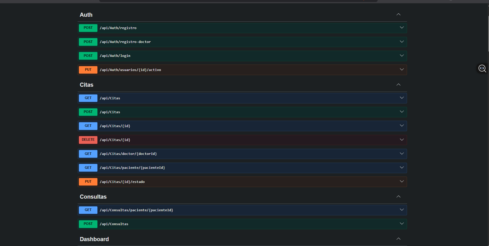
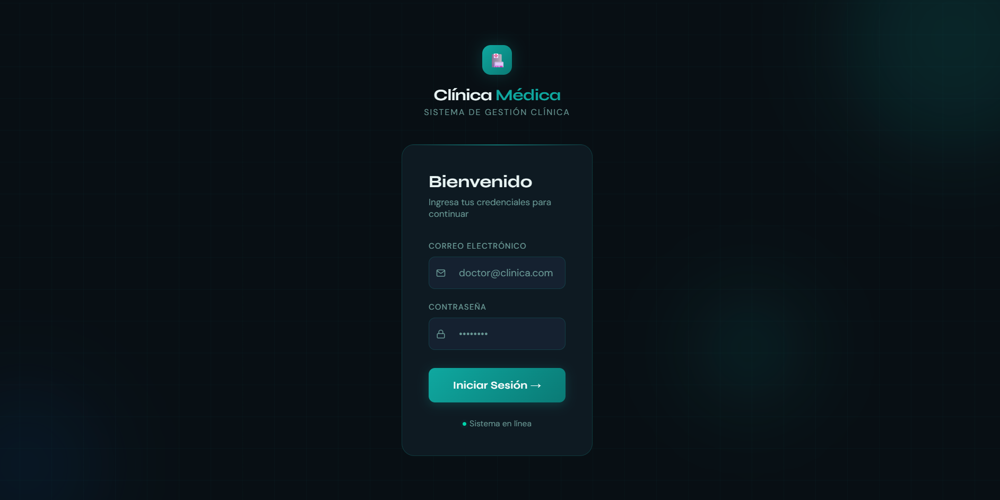
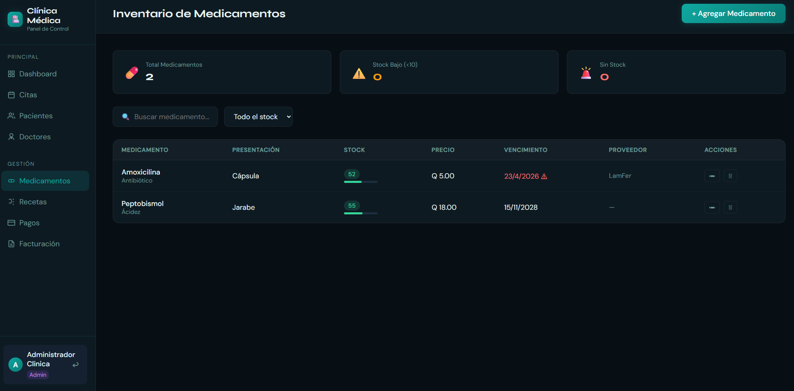
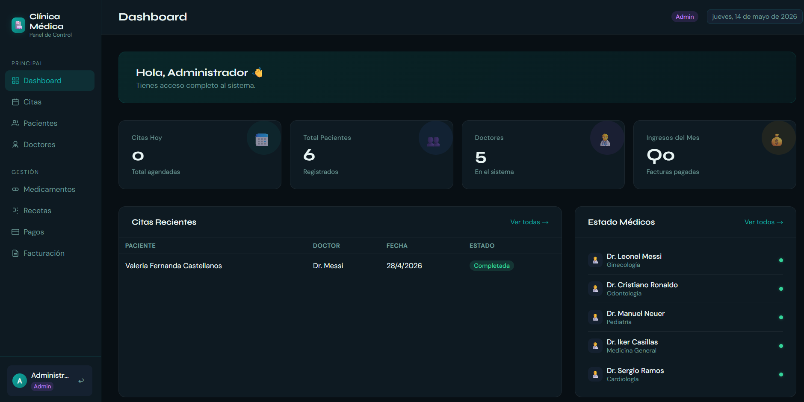

# 🏥 Sistema de Gestión Clínica Médica

Sistema web full-stack para la administración completa de una clínica médica. Desarrollado con ASP.NET Core 8, SQL Server y JavaScript vanilla.


---

##  Vista del Sistema

### Backend API — Swagger/OpenAPI


### Login


### Inventario


### Dashboard


---

## ✨ Funcionalidades

- **Autenticación JWT** con 4 roles: Administrador, Doctor, Recepcionista, Paciente
- **Control de acceso granular (RBAC)** — cada endpoint verifica permisos por rol
- **Gestión de citas** con validación de horarios y detección de solapamiento
- **Recetas médicas** con modal de impresión y texto libre
- **Pagos** con IVA 12% calculado automáticamente en el backend
- **Facturación** con numeración correlativa (FAC-YYYY-NNNN)
- **Venta directa** de medicamentos con descuento de stock automático
- **Historial clínico** por paciente
- **Notificaciones por correo** (bienvenida, citas, pagos, facturas)
- **Dashboard** con estadísticas en tiempo real diferenciadas por rol

---

## 🗂️ Estructura del Proyecto

```
ClinicaAPI/          → Backend ASP.NET Core 8
├── Controllers/     → 12 controladores REST (60+ endpoints)
├── Models/          → 16 entidades (tablas SQL Server)
├── Data/            → DbContext, RoleSeeder
├── Services/        → AccessControlService, EmailService
├── Migrations/      → Historial EF Core
└── Program.cs       → Configuración de servicios y middleware

Clinica_frontend/    → Frontend HTML/CSS/JS
├── index.html       → Login
├── dashboard.html   → Panel principal
├── citas.html       → Gestión de citas
├── pacientes.html   → Gestión de pacientes
├── doctores.html    → Gestión de doctores
├── pagos.html       → Registro de pagos
├── facturacion.html → Emisión de facturas
├── recetas-internas.html → Recetas (staff)
├── mis-recetas.html → Recetas (paciente)
├── medicamentos.html → Catálogo de medicamentos
├── auth.js          → Módulo de autenticación JWT
└── validaciones.js  → Validaciones de formularios
```

---

## 🛠️ Stack Tecnológico

| Capa | Tecnología |
|------|-----------|
| Backend | ASP.NET Core 8, C#, Entity Framework Core |
| Base de datos | SQL Server 2022 |
| Autenticación | JWT (HMAC-SHA256), BCrypt |
| Frontend | HTML5, CSS3, JavaScript (vanilla) |
| Email | MailKit (SMTP) |
| Documentación | Swagger / OpenAPI |

---

## 🚀 Instalación y Configuración

### Requisitos previos
- [.NET 8 SDK](https://dotnet.microsoft.com/download/dotnet/8.0)
- SQL Server 2022 (o SQL Server Express)
- Visual Studio Code con extensión Live Server

### 1. Clonar el repositorio
```bash
git clone https://github.com/TU_USUARIO/clinica-medica.git
cd clinica-medica
```

### 2. Configurar el backend
```bash
cd ClinicaAPI

# Copiar y editar la configuración
cp appsettings.example.json appsettings.json
# Edita appsettings.json con tu connection string y JWT key
```

### 3. Crear la base de datos
```bash
dotnet ef database update
```
Esto crea automáticamente las 16 tablas y siembra los roles iniciales.

### 4. Ejecutar el backend
```bash
dotnet run
# API disponible en: http://localhost:5190
# Swagger en:        http://localhost:5190/swagger
```

### 5. Ejecutar el frontend
Abre `Clinica_frontend/index.html` con **Live Server** en VS Code, o:
```bash
cd Clinica_frontend
python -m http.server 5500
# Abre: http://localhost:5500/index.html
```

---

## 👥 Usuarios de prueba

Al ejecutar la aplicación por primera vez, se crean los roles automáticamente. Puedes registrar usuarios desde Swagger (`POST /api/auth/registro`) o desde la interfaz.

| Rol | RolId |
|-----|-------|
| Administrador | 1 |
| Doctor | 2 |
| Paciente | 3 |
| Recepcionista | 4 |

---

## 📐 Diseño de Base de Datos

16 tablas relacionadas:

`Usuarios` · `Roles` · `Doctores` · `Pacientes` · `Especialidades`
`Citas` · `DoctorHorarios` · `BloqueosHorario` · `EstadoMedico`
`Recetas` · `DetalleReceta` · `Medicamentos`
`Pagos` · `MetodosPago` · `Facturas`
`VentasDirectas` · `DetalleVentaDirecta`
`HistoriasClinicas` · `DetalleHistoriaClinica`

---

## 🔐 Seguridad

- Contraseñas hasheadas con **BCrypt**
- Tokens **JWT** firmados con HMAC-SHA256, expiración 7 días
- Campo `PasswordHash` excluido del JSON con `[JsonIgnore]`
- Control de acceso por rol en cada endpoint con `[Authorize(Roles="...")]`
- **RBAC granular**: Doctor solo ve pacientes que ha atendido; Paciente solo ve su propio perfil
- Referencias circulares resueltas con `ReferenceHandler.IgnoreCycles`

---

## 📬 Configuración de Correos (Opcional)

El sistema envía correos automáticos en: registro de usuarios, confirmación de citas, cambios de estado, pagos y facturas.

Configura la sección `Smtp` en `appsettings.json` con tu cuenta Gmail y una [contraseña de app](https://myaccount.google.com/apppasswords).

> **Nota:** En redes locales los puertos SMTP (587/465) pueden estar bloqueados. Los correos funcionan correctamente al desplegar en un servidor en la nube.

---

## 📄 Licencia

MIT License — libre para uso educativo y personal.

---

*Desarrollado como proyecto de capacitación en Desarrollo de Software Full-Stack.*
